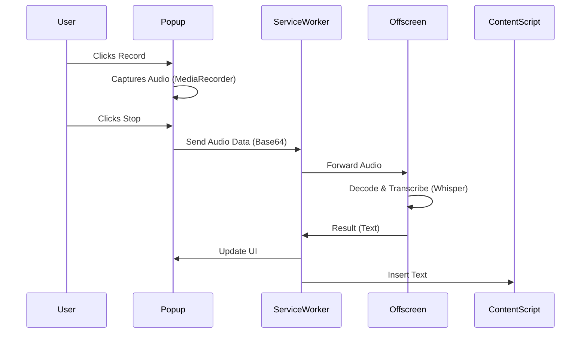

# System Patterns

## The "Triad" Architecture
Chrome extensions often fail because developers put too much logic in one place. We split strict responsibilities:

1.  **The UI (Popup):**
    -   *Role:* Dumb view layer.
    -   *Responsibility:* Capture Audio (`MediaRecorder`), show buttons, show progress.
    -   *Restriction:* Does **NOT** run AI. Does **NOT** format text.

2.  **The Manager (Service Worker):**
    -   *Role:* Traffic Controller.
    -   *Responsibility:* Routes messages between Popup and Offscreen. Handles keyboard shortcuts.
    -   *Restriction:* Can stop at any time. **NO** persistent state variables in memory (use `storage.local`).

3.  **The Worker (Offscreen Document):**
    -   *Role:* Heavy Lifter.
    -   *Responsibility:* Loads the WASM model. Decodes audio. Runs inference.
    -   *Why Offscreen?* Service Workers cannot access the DOM (`AudioContext` needs DOM) and have strict memory/time limits. An offscreen document is like a hidden tab that stays alive as long as we need it.

## Data Flow

## Error Handling Pattern
-   **Timeouts:** Every message to the Offscreen document must have a timeout (e.g., 30s). If it hangs, kill it and restart.
-   **Model Loading:** The model download is the riskiest part. We must expose precise progress % to the user so they know it's not broken.
